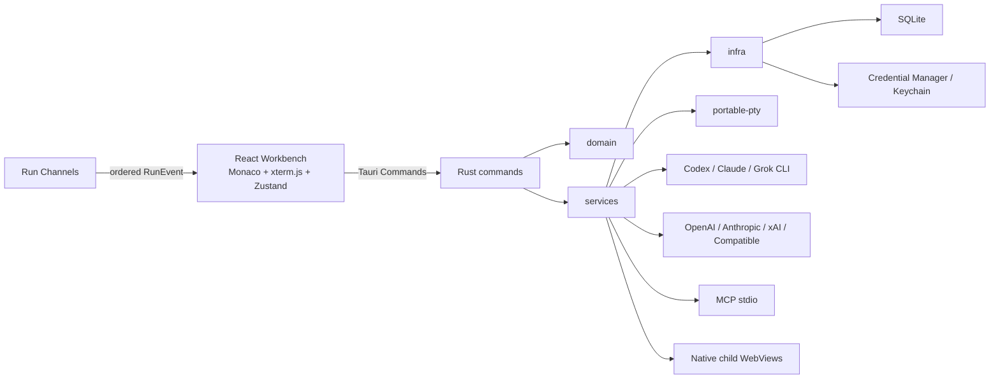

# HerDock 桌面架构

## 边界

HerDock 是单进程桌面 ADE。WebView 负责显示与交互，Rust Core 拥有文件系统、进程、数据库和网络权限。没有 Go sidecar、localhost HTTP 服务或 Cloud 依赖。



## 目录

```text
src/                    React UI、状态与 Tauri client
src-tauri/src/commands  业务化 Tauri Commands
src-tauri/src/domain    序列化模型与 RunEvent
src-tauri/src/services  Run、Provider、PTY、工作区、安全与调度
src-tauri/src/infra     SQLite 与系统密钥库
src-tauri/migrations    版本化 SQL migration
docs/                   架构、安全、发布与设计验收
```

## Run 生命周期

1. `run_start` 校验 workspace、session、provider，并持久化 Run 和用户消息。
2. CLI Provider 使用参数数组启动子进程，并把机器输出中的消息、计划、工具、usage 与错误归一化为 `ProviderEvent`；API Provider 使用 SSE 增量流。
3. CLI 在 `provider + workspace + sandbox` 运行级精确审批后交给自身 sandbox；API 与 HerDock 托管的 MCP 工具进入统一逐工具审批执行器。
4. CLI 和命令执行前创建工作区级检查点，写文件前创建单文件检查点；事件按 Run 内递增 `seq` 写入 SQLite，再发到 Channel。
5. 完成后扫描 Git 变更与 `out/` 产物，记录 usage 并发送系统通知。
6. 异常退出后，数据库启动流程把未结束 Run 标记为 `interrupted`，不伪造子进程恢复。

新写入的 RunEvent 仅使用 `queued`、`assistant_delta`、`plan_updated`、`tool_requested`、`approval_required`、`tool_output`、`file_patch`、`usage_updated`、`checkpoint_created`、`completed`、`failed` 和 `cancelled`。前端读取历史记录时仍兼容旧事件名。

## 状态

`tauri::State<AppState>` 管理数据库、活动 Run 的取消令牌、待审批请求、PTY 实例、浏览器子 WebView 与数据目录。SQLite 使用单连接串行访问；WebView 不直接访问数据库或系统命令。

## 动态标签与浏览器

中间标签栏允许创建独立的 Agent、编辑器、终端、活动和浏览器视图。浏览器视图由 Rust `BrowserManager` 管理真实的 Tauri 子 WebView；React 只维护工具栏、标签元数据和子 WebView 的逻辑坐标。切换标签时隐藏非活动浏览器，关闭标签或应用时销毁对应 WebView。

## 设计工作区

Sidebar 的“设计”入口切换到独立 `AppSurface`，不占用 Workbench 的动态标签状态。设计任务仍通过既有 Session、Run、审批、Checkpoint、Provider、Skill、上下文和 MCP 链路执行，不引入第二套 Agent Runtime。

设计产物以文件为源：`out/design/<id>/artifact.json` 声明稳定 ID、入口、种类、Renderer、状态和导出能力，入口 HTML 与素材保存在同一目录。产物扫描器把合法 manifest 目录索引为一个逻辑产物，并继续兼容 `out/` 下原有的松散文件。

设计系统从应用数据目录的 `design-systems/` 和工作区 `.herdock/design-systems/` 发现；工作区同 ID 包覆盖全局包。包以 `DESIGN.md` 为设计说明，可选 `manifest.json` 和 `tokens.css`，选中内容在 Run 启动前组合进设计 brief。

Browser Use 通过统一 Tool Registry 暴露固定工具，不向 Provider 提供任意 JavaScript 执行能力。页面快照、导航、搜索、点击和输入都在 Rust 内映射为受限操作，并复用 Run 的事件、取消与审批流程。

## 调度

Cron 调度器仅在应用或托盘进程存活时轮询。启动时会计算下次执行时间，但不会补跑关机期间遗漏任务。
